# InfoSec CTF Writeup

Author : Akash Sebastian<br>
Cyber Talents Profile : https://cybertalents.com/members/AkashSeb/profile <br>

## Silly Freemason
---


Given cipher is a pigpen Cipher, Simply decode it using [Pigpen Cipher Decoder](https://www.boxentriq.com/code-breaking/pigpen-cipher)

Flag : `FLAG{EASYASONETWOTHREE}`

## G(OLD)
---


```py
from pwn import xor
ct = 
known_plaintext = b'FLAG{'
partial_key = xor(ct[:5],known_plaintext)
# rest the key has 3 letters which can be bruteforced
print(xor(ct,key))
```

## Riv
---


```py
from Crypto.Util.numbers import *
from gmyp2 import iroot
ct = 
e = 
print(long_to_bytes(iroot(c,e)[0]))
```

## exclus1ve
---

At First I disassembled the binary file and saw it is performing XOR operation on some strings. I opened it in GDB and put a breakpoint at main function.

Then put another break point at instruction `cmp    DWORD PTR [rbp-0x4],0x20`.

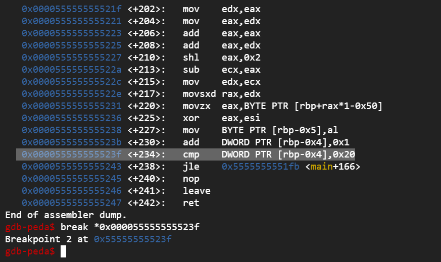

Then hit continue till the program exit. 

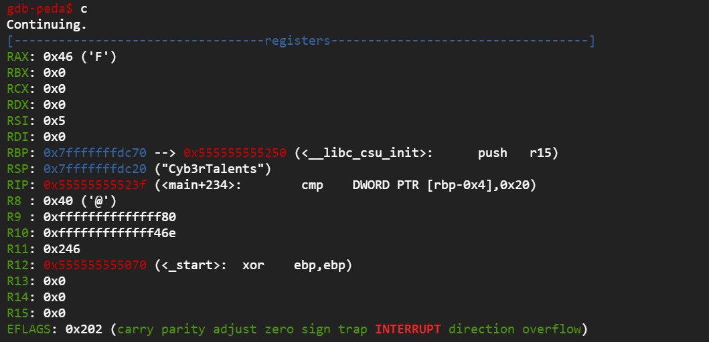


On each Iteration I got characters of flag. Appended them together to get the final flag.

FLAG : `FLAG{Great_efforts_Great_results}`

## Decryptor
---

Opened the file in JADX to check its source code. The app have AES encryption functions and it performed on some string. But IV, key and AES Cipher can't be found there.

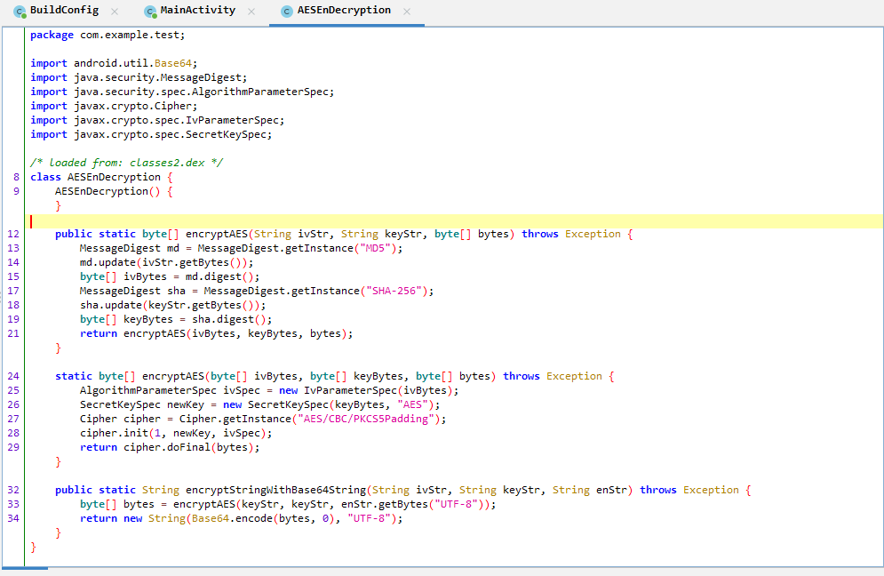

So I Decompiled the apk using apktool : `apktool d Decryptor.apk` and found required data in `strings.xml`.

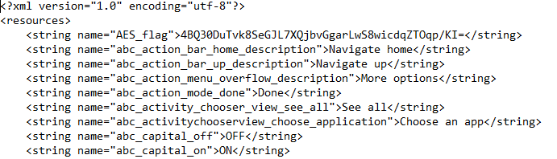

Then I simply created an AES decryption program and got the flag.

```java

import java.util.Base64;
import java.security.MessageDigest;
import java.security.spec.AlgorithmParameterSpec;
import javax.crypto.Cipher;
import javax.crypto.spec.IvParameterSpec;
import javax.crypto.spec.SecretKeySpec;

/* loaded from: classes2.dex */
class AES {
    
    public static void main(String [] args)  {
        String iv = "London";
        String key = "Japan2Italy";
        String AES_flag = "4BQ30DuTvk8SeGJL7XQjbvGgarLwS8wicdqZTOqp/KI=";
        String Decrypted = "";
        try{
            Decrypted = decryptString(iv, key, AES_flag);
        } catch (Exception e) {
            System.out.println(e);
        }
        System.out.println(Decrypted);
    }

    public static byte[] decryptAES(String ivStr, String keyStr, byte[] bytes) throws Exception {
        MessageDigest md = MessageDigest.getInstance("MD5");
        md.update(ivStr.getBytes());
        byte[] ivBytes = md.digest();
        MessageDigest sha = MessageDigest.getInstance("SHA-256");
        sha.update(keyStr.getBytes());
        byte[] keyBytes = sha.digest();
        return decryptAES(ivBytes, keyBytes, bytes);
    }

    static byte[] decryptAES(byte[] ivBytes, byte[] keyBytes, byte[] bytes) throws Exception {
        AlgorithmParameterSpec ivSpec = new IvParameterSpec(ivBytes);
        SecretKeySpec newKey = new SecretKeySpec(keyBytes, "AES");
        Cipher cipher = Cipher.getInstance("AES/CBC/PKCS5Padding");
        cipher.init(Cipher.DECRYPT_MODE, newKey, ivSpec);
        return cipher.doFinal(bytes);
    }

    public static String decryptString(String ivStr, String keyStr, String enStr) throws Exception {
        byte[] bytes = decryptAES(keyStr, keyStr, Base64.getDecoder().decode(enStr));
        return new String(bytes, "UTF-8");
    }
}

```

Flag : `Flag{G@M30V3R_D3CRYPT0R}`

## Magic Byte5
---

Challenge Description : Can we rely only on file extensions to detect file type?

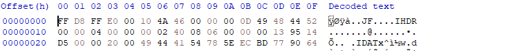

The header of file were corrupted, the file had PNG data chunks (IHDR, IDAT).
So replaced first 16 bytes of the file with PNG header `89 50 4E 47 0D 0A 1A 0A 00 00 00 0D 49 48 44 52`. Rename the file extenstion to `.png`


Flag : `FLAG{PNG_N0T_JPEG}`

## Out of Sight
---

Challenge Description : One of my friends told me that he learned a new awesome technique to embed files in images, Can you analyse this image and locate what has he embeded inside.

Firstly I run exiftool on the image

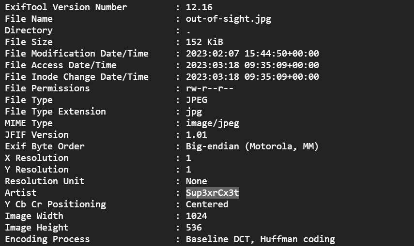

Found a suspicious string `Sup3xrCx3t`.

Tried steghide on the file, but no result.

Then tried `foremost` and found a zip file, using the suspicious string as password got the flag.

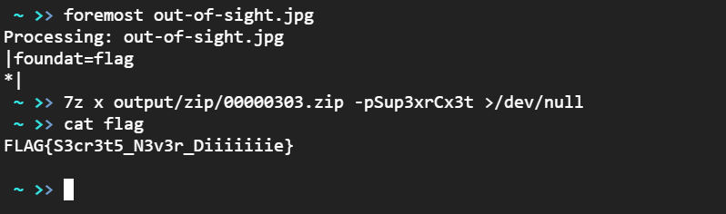

Flag : `FLAG{S3cr3t5_N3v3r_Diiiiiiie}`

## tw1ns
---

We are given a hccapx file which is a hashcat file of WPA authentication packets. It can be used to crack WiFi password.

We need to find the BSSID(MAC) of the WiFi Access Point, I used hcpxread tool to extract BSSID from the hccapx file.

```sh
go install github.com/vlad-s/hcpxread@latest

hcpxread -capture challenge.hccapx
```

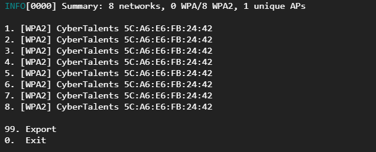

In new hashcat versions hccapx is deprecated, so we have to convert it to newer standard `hc22000` format. After that run hashcat to get the password of WiFi AP.

```sh

hcxhash2cap challenge.hccapx -c challenge.cap

hcxpcapngtool challenge.cap -o challenge.hc22000

hashcat -m 22000 challenge.hc22000 rockyou.txt

```

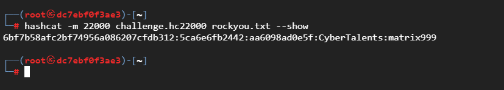

Flag : `flag{5C:A6:E6:FB:24:42_matrix999}`

## Xerox
---

We are given a memory dump, I checked its profile using volatility and got profile `Win7SP1x64`. The challenge says we need to find a URL, I Checked the `cmdline` and found Notepad have a URL file opened.

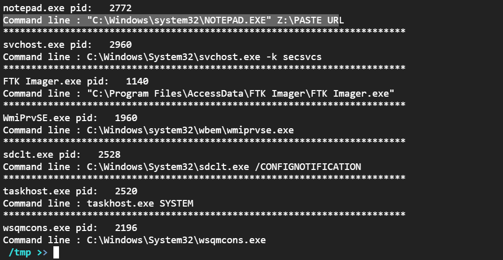

Then I checked the clipboard and found a pastebin URL.

```sh
/tmp >> vol.py -f Xerox.mem --profile=Win7SP1x64 clipboard
Volatility Foundation Volatility Framework 2.6.1
Session    WindowStation Format                         Handle Object             Data                                    
--------- ------------------------------- ------------------------------ ---------------------------------

1 WinSta0       CF_UNICODETEXT                0x200f9 0xfffff900c1feedc0 https://pastebin.com/vB0gDmdm

1 WinSta0       CF_TEXT                          0x10 ------------------                                         
1 WinSta0       0x12017fL              0x200000000000 ------------------                                         
1 WinSta0       CF_TEXT                           0x1 ------------------                                         
1 ------------- ------------------           0x12017f 0xfffff900c0708c00     
```

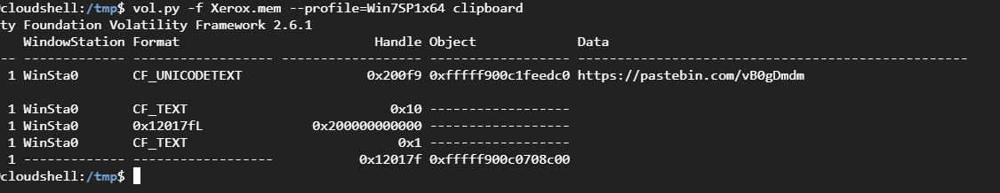

Visit the pastebin to get the flag.

Flag : `FLAG{HiddenInTheSand}`

## Ph0n3
---

Extracted the tar file and got a `image.dd` dump. Opened it in FTK Imager. We have to crack the pattern of the given phone dump.

The pattern data is stored in a file called `gesture.key` which is located at `/data/system/`. It contains a SHA1 hash of the pattern numbers. We just need to bruteforce numbers with same length to find the pattern.

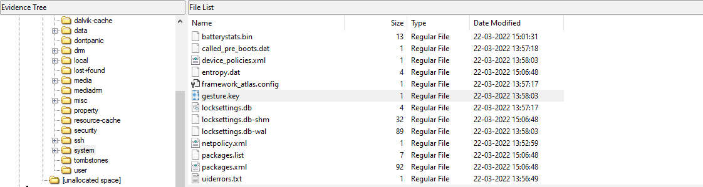

I used androidpatternlock script to crack the pattern.

```sh

git clone https://github.com/sch3m4/androidpatternlock

Replace .encode('hex') to .hex() in aplc.py

################################
# Android Pattern Lock Cracker #
#             v0.2             #
# ---------------------------- #
#  Written by Chema Garcia     #
#     http://safetybits.net    #
#     chema@safetybits.net     #
#          @sch3m4             #
################################

[i] Taken from: http://forensics.spreitzenbarth.de/2012/02/28/cracking-the-pattern-lock-on-android/

[:D] The pattern has been FOUND!!! => 240156378

[+] Gesture:

  -----  -----  -----
  | 3 |  | 4 |  | 1 |
  -----  -----  -----
  -----  -----  -----
  | 7 |  | 2 |  | 5 |
  -----  -----  -----
  -----  -----  -----
  | 6 |  | 8 |  | 9 |
  -----  -----  -----

It took: 3.8582 seconds
```

Next step is to find the DDownloaded file which is located at `/data/media/0/Download/`.

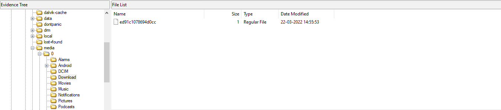

Flag : `flag{240156378_ed91c1078694d0cc}`

## Cool_PyC
___

Challenge says the given file is an ELF made out of python 3.9, which is really interesting. Python scripts can be compiled to binary using pyinstaller module. Thankfully the created binaries can be made back to python source as well, That is, its reversible.

I Used the pyinstxtractor tool to extract py source from the ELF file.

```
git clone https://github.com/extremecoders-re/pyinstxtractor

python3 pyinstxtractor.py cool_pyc

cat cool_pyc.pyc
```

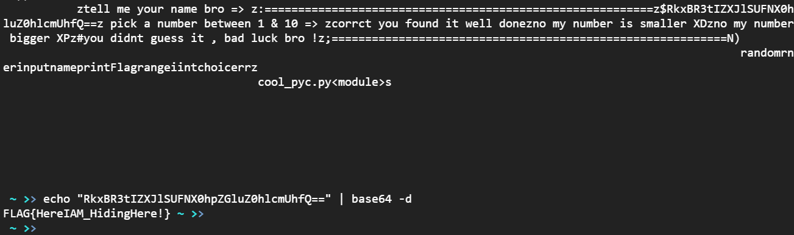

Flag : `FLAG{HereIAM_HidingHere!}`

## Rooter
---

This Android app checks root access , If root access is found it will stop.  

```java
try {
    if (checknotroot()) {
        Thread.sleep(60000L);
        if (!checkroot()) {
            finishAndRemoveTask();
            return;
        }
        while (true) {
            Thread.sleep(1000L);
            generate("MyValue");
        }
    } else {
            finishAndRemoveTask();
        }
    } catch (Exception e) {
    e.printStackTrace();
}

// another segment

private boolean checkroot() {
    File sufile = new File("/system/xbin/su");
    File r1_file = new File("/system/bin/su");
    if (sufile.exists() || r1_file.exists()) {
        return true;
    }
    return false;
}

private boolean checknotroot() {
    File sufile = new File("/system/xbin/su");
    File r5_file = new File("/system/bin/su");
    if (!sufile.exists() && !r5_file.exists()) {
        return true;
    }
    return false;
}

void generate(String x) {
    Log.d("Creating", x);
    if (x.equals("Game_Stranger")) {
        String flag = decryptFromJniRead(Flag(), stringFromJNIKey());
    Log.d("Flag", flag);
}

```

But here even if the device is unrooted it will stop working because, on the second if statement `!checkroot()` will give false result and hence the app won't continue.

Also if we somehow manage to bypass root check, still we won't get the flag. Because the arguement passed `generate()` function must be `Game_Stranger`.

I used a real phone to exploit this app. Here are the python script and frida exploit scripts.

```py
#exploit.py

import frida
import time

device = frida.get_usb_device()
pid = device.spawn(["com.io.junroot"])
device.resume(pid)
time.sleep(1)
session = device.attach(pid)
script = session.create_script(open("exploit.js").read())
script.load()

input()
```


```js
//exploit.js

console.log("Script loaded successfully ");
Java.perform(function x(){ //Silently fails without the sleep from the python code
    console.log("Inside java perform function");
    //get a wrapper for our class
    var my_class = Java.use("com.io.junroot.MainActivity");
    //replace the original implmenetation of the function `fun` with our custom function
    my_class.checkroot.implementation = function(){
    //print the original arguments
    console.log( "inside function checkroot");
    //call the original implementation of `fun` with args (2,5)
    var ret_value = true;
    return ret_value;
    }

    my_class.generate.implementation = function(x){
        console.log("inside function generate");
        console.log( "original call: generate("+ x +")");
        var flag = this.generate("Game_Stranger"); 
    }

});
```

Once exploited, we just need to find `JNICrypt` pattern in the `adb logcat`.

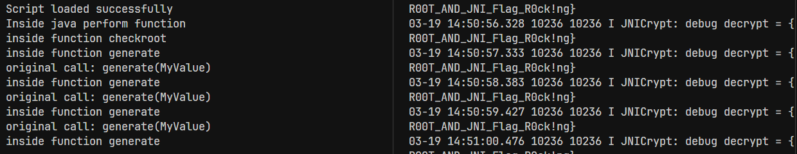

Flag : `{R00T_AND_JNI_Flag_R0ck!ng}`

## Evil_access
---

The given app is a Flutter app, its a debug build. Flutter ships source code with debug builds. We can find it in the `kernel_blob.bin` file.

Extract evil-access.apk and run strings on `evil-access\assets\flutter_assets\kernel_blob.bin`.

You can either grep the result or save it to a text file and then search for `UserName` string, at the bottom of the file we can find the source of the app. There we can find the flag and correct username + password.

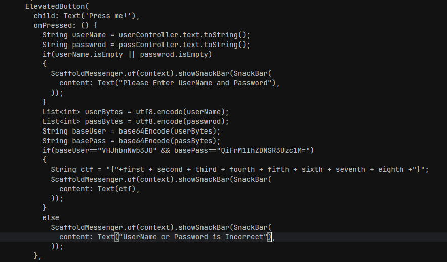

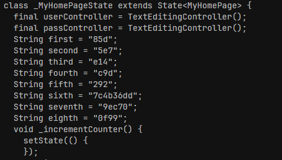

Then appending the values of the strings we get Flag.

`85d5e7e14c9d2927c4b36dd9ec700f99`